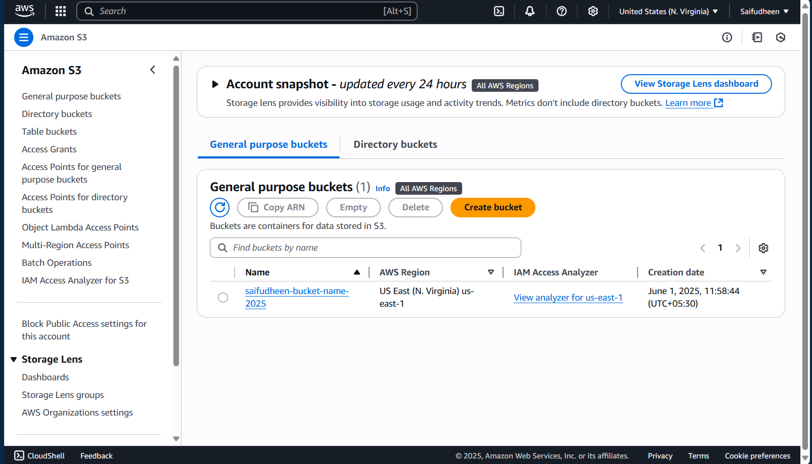

# Terraform S3 Bucket Configuration

This repository contains Terraform configuration for creating a secure S3 bucket in AWS with proper ownership controls and private access.

## Features

- Creates an S3 bucket with a globally unique name
- Configures bucket ownership controls
- Sets bucket ACL to private
- Uses AWS provider with configurable region

## Prerequisites

- Terraform installed (version 1.0.0 or later)
- AWS credentials configured
- AWS CLI installed (optional)

## Usage

1. Clone the repository:
```bash
git clone https://github.com/yourusername/terraform-s3.git
cd terraform-s3
```

2. Initialize Terraform:
```bash
terraform init
```

3. Review the execution plan:
```bash
terraform plan
```

4. Apply the configuration:
```bash
terraform apply
```

## Configuration

The following variables can be configured in `variables.tf`:

- `region`: AWS region (default: "us-east-1")
- `bucket_name`: Globally unique name for the S3 bucket

## Screenshot


## License

This project is licensed under the MIT License - see the [LICENSE](LICENSE) file for details.

## AWS Free Tier

This configuration uses AWS S3 which is eligible for the AWS Free Tier:
- 5GB of storage
- 20,000 GET requests
- 2,000 PUT requests
- 15GB of data transfer out

Please monitor your AWS Billing Dashboard to ensure you stay within the free tier limits.